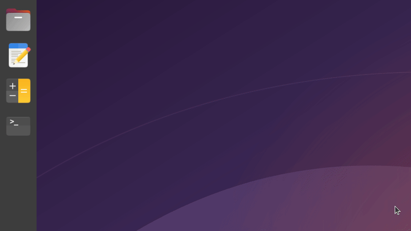
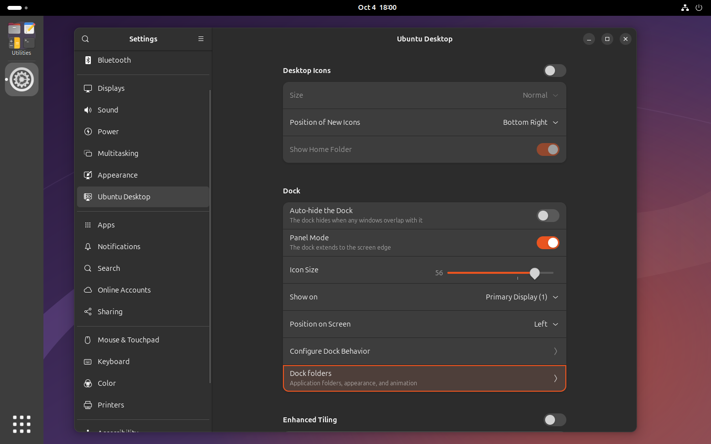
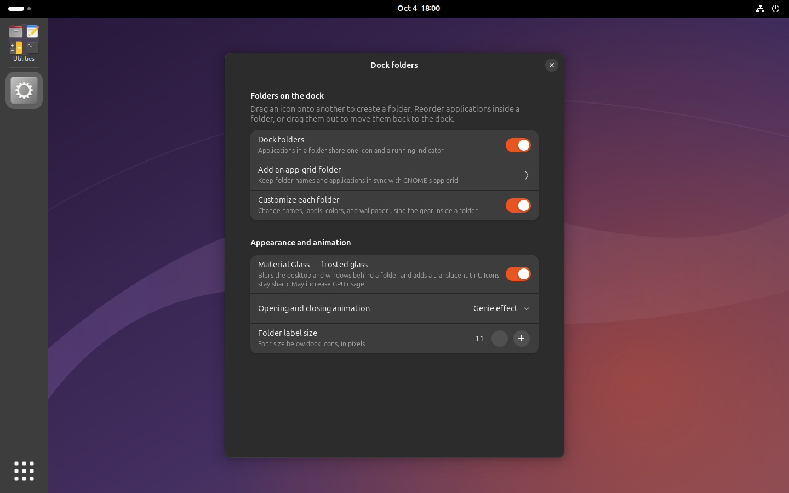
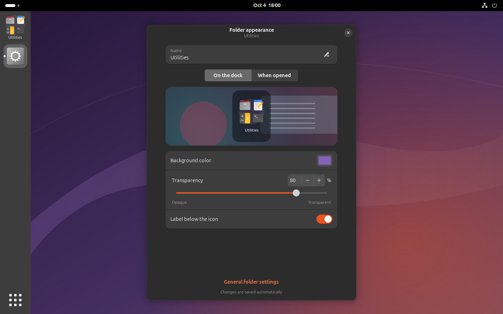
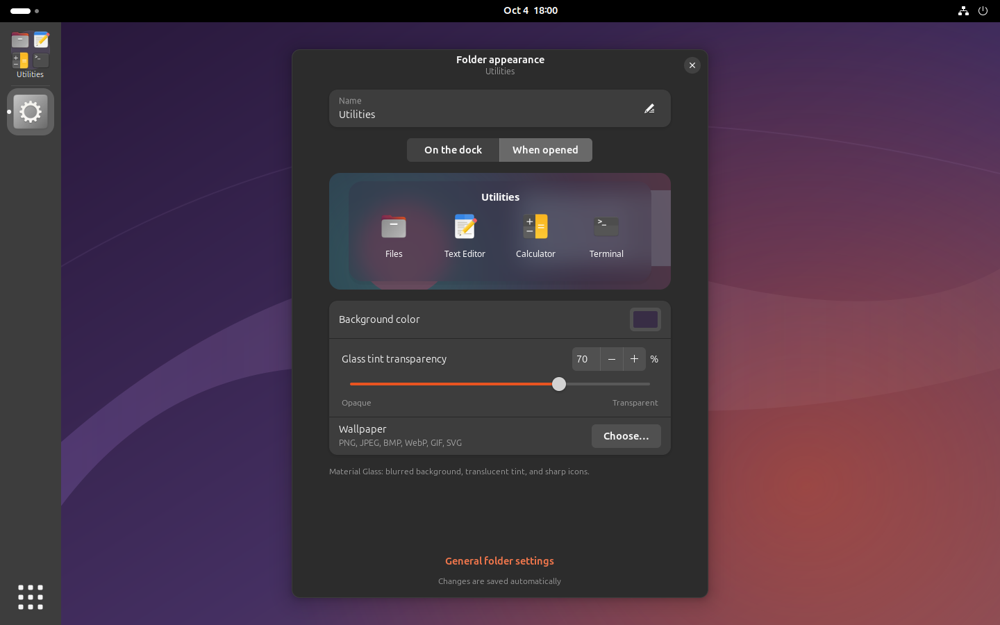
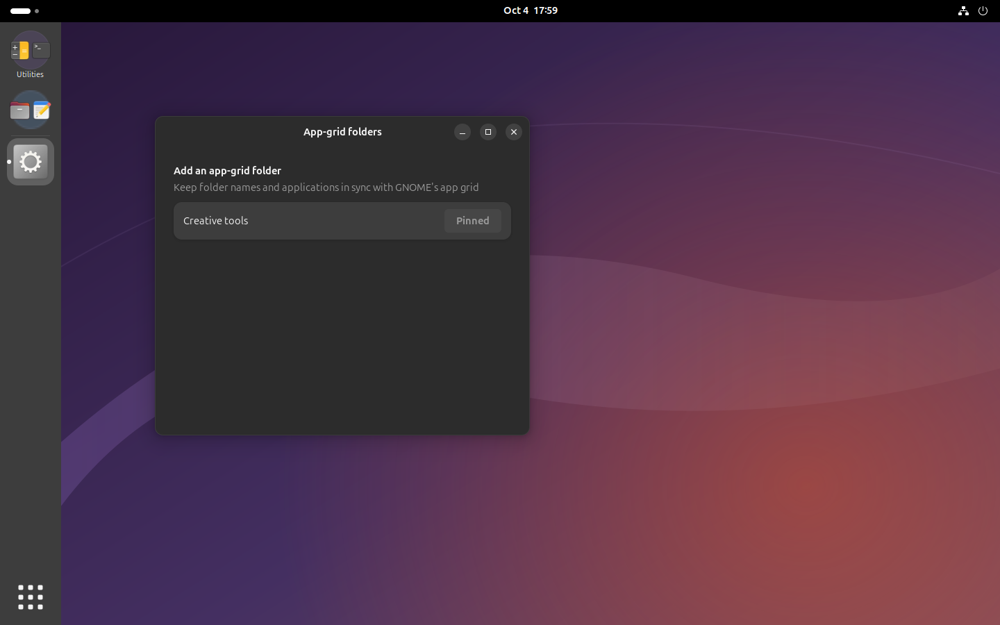
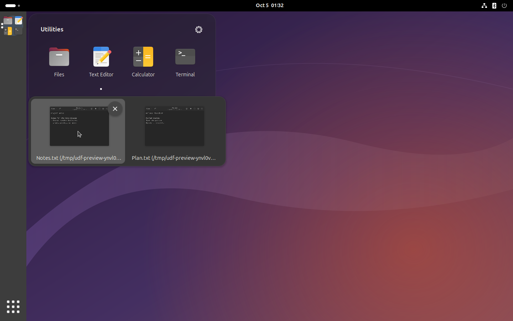

## Ubuntu Dock Folders

Android-style application folders for **Ubuntu 26.04 / GNOME 50**, also compatible with Ubuntu 24.04 / GNOME 46. Drag one dock icon onto another to create a folder, rearrange its apps, and drag them out again. Each folder shows larger application icons that overlap the folder circle, plus a shared running indicator. Opening animations start at the folder's position on the dock.



[Watch the video (MP4)](docs/demo.mp4) · [WebM](docs/demo.webm). The recording shows a folder being created by dragging icons, two more apps being added, and the folder opening and closing. Cursor movements are shown at four times the recording speed.

**Reuse existing GNOME app-grid folders**, with names and membership synchronized in both directions. **Hover over an application inside a folder to preview its windows**, activate one or close it. Running indicators appear as soon as a window opens, including while Chrome or another application is still starting. **Undo the last grouping move** from its notification, the folder header or Ctrl+Z.

Per-folder settings include names, labels, colors, transparency and wallpaper. Optional Material Glass blurs the desktop behind the folder while keeping its icons sharp. The interface follows the system language, with 30 translations and right-to-left layouts for Arabic and Urdu.

<details>
<summary>Settings screenshots</summary>

**Settings → Ubuntu Desktop → Dock.** The added **Dock folders** entry is highlighted.



**General settings.** Enable grouping, add a synchronized app-grid folder, customize appearance, choose Material Glass, animation and label size.



**Folder appearance — On the dock.** Name, color, transparency and label visibility, with a live preview.



**Folder appearance — When opened.** Background color, glass tint transparency and wallpaper, with a live preview.



**Existing app-grid folders.** Pin a folder without recreating it.



**Window previews on hover.** Hover over an application to choose or close a window. Previews load only while needed.



</details>

This extension adds grouping directly to Ubuntu Dock.

| Feature | Ubuntu Dock Folders 1.1 | Pin App Folders to Dash | Dash to Dock |
| --- | --- | --- | --- |
| Create folders by dropping dock icons onto each other | Yes | Uses application-grid folders | No application folders |
| Grouped running indicators without extra dock icons | Yes | Not documented | Indicators per application |
| Folder colors, wallpaper and transparency | Per folder | Standard GNOME folder appearance | Dock-wide appearance |
| Frosted background and genie animation for folders | Yes | Not documented | No application folders |
| Reuse and synchronize GNOME application-grid folders | Yes, opt-in | Yes | No application folders |
| Window previews with activation and close controls | On hover inside folders | Not documented | Yes |
| Undo grouping changes | Last creation or move | Undo pin/unpin | No grouping |
| GNOME support | 50 / Ubuntu 26.04; also 46 / Ubuntu 24.04 | 43 | Multiple versions |

Comparison follows the projects' published [extension listing](https://extensions.gnome.org/extension/5709/pin-app-folders-to-dash/) and [source](https://github.com/micheleg/dash-to-dock), checked in October 2026. Features marked “Not documented” are unverified. Ubuntu Dock's existing window-management features remain available outside folders.

[](https://hawkab.github.io/support/)

Optional contributions support maintenance and testing. The [support page](https://hawkab.github.io/support/) has a QR code, wallet link and copy buttons, and works on computers and phones. You choose the amount in your wallet.

<details>
<summary>QR code and wallet details</summary>


**Recipient · TON network**

```text
UQAHqYcL2i1sls0c_R9o22r-m3zORIg2bzCC1gGW4rjK94G9
```

**Payment link** — copy into a compatible wallet:

```text
ton://transfer/UQAHqYcL2i1sls0c_R9o22r-m3zORIg2bzCC1gGW4rjK94G9?jetton=EQCxE6mUtQJKFnGfaROTKOt1lZbDiiX1kCixRv7Nw2Id_sDs
```

</details>

## Install and configure

Use the [signed APT repository](https://hawkab.github.io/apt/) to receive updates through Ubuntu’s package manager:

```sh
sudo install -d -m 0755 /etc/apt/keyrings
curl -fsSL https://hawkab.github.io/apt/archive-key.gpg | sudo tee /etc/apt/keyrings/hawkab-archive-keyring.gpg >/dev/null
curl -fsSL https://hawkab.github.io/apt/hawkab.sources | sudo tee /etc/apt/sources.list.d/hawkab.sources >/dev/null
sudo apt update
sudo apt install ubuntu-dock-folders
ubuntu-dock-folders enable --ubuntu-settings
```

On Ubuntu 24.04, you can alternatively use the [Launchpad PPA](https://launchpad.net/~hwakaba/+archive/ubuntu/ubuntu-dock-folders): `sudo add-apt-repository ppa:hwakaba/ubuntu-dock-folders`, then update and install the package. Choose one APT source. For manual installation on either supported Ubuntu version, download the `.deb` from [GitHub Releases](https://github.com/hawkab/ubuntu-dock-folders/releases) and open it with your package installer, or run `sudo apt install ./ubuntu-dock-folders_*.deb`. Enable it with the command above.

The extension supports desktop and laptop computers running Ubuntu 26.04 / GNOME 50, with backward compatibility for Ubuntu 24.04 / GNOME 46. Keyboard, mouse and touch input are supported. Install version 1.1.0 or later for GNOME 50 through the signed APT repository or GitHub Releases. The Launchpad PPA targets Ubuntu 24.04.

| Desktop | Wayland session | X11 session | X11 apps through Xwayland |
| --- | --- | --- | --- |
| Ubuntu 26.04 / GNOME 50 | Supported | Removed by GNOME | Supported |
| Ubuntu 24.04 / GNOME 46 | Supported | Supported | Supported |

[GNOME 50 removed X11 sessions](https://gjs.guide/extensions/upgrading/gnome-shell-50.html). X11 applications still work through Xwayland. This extension requires GNOME Shell and Ubuntu Dock; Xfce and other desktop environments use their own panels.

To build and install from this repository:

```sh
sudo apt install git make dpkg-dev gcc pkg-config gettext libglib2.0-dev librsvg2-common gnome-shell gnome-shell-ubuntu-extensions libgtk-4-1 libadwaita-1-0 python3-gi python3-pil python3-cairo python3-gi-cairo gir1.2-gtk-4.0 gir1.2-gdkpixbuf-2.0 gir1.2-adw-1
git clone https://github.com/hawkab/ubuntu-dock-folders.git
cd ubuntu-dock-folders
make install
```

On Ubuntu 24.04, replace `gnome-shell-ubuntu-extensions` with `gnome-shell-extension-ubuntu-dock` in the dependency command. `make build` produces the `.deb` and standard GNOME extension ZIP in `dist/`. For an extension-only installation, install the ZIP with `gnome-extensions install --force`, then enable `dock-groups@local`. Log out and back in after installing or updating Shell code.

Open **Settings → Ubuntu Desktop → Dock → Dock folders**, or **Ubuntu Dock Folders** in the application menu. The optional Ubuntu Settings integration adds a user-local launcher override; reopen Settings after enabling it. The standalone ZIP uses `gnome-extensions prefs dock-groups@local` instead.

Enable grouping, then drag icons to create folders. Use **Add an app-grid folder** to pin an existing GNOME folder; subsequent name and membership changes stay synchronized. Linked folders remain pinned if emptied, so you can refill them in the app grid. Hover over an application in an open folder to preview its windows. You can move the pointer into a preview to activate or close a window; keyboard focus also opens previews. After grouping or moving an application, use **Undo** in the notification or the folder header; Ctrl+Z also works while the folder is open. The Undo button is visible only while a grouping action can be undone; undo history is cleared when you log out or restart GNOME Shell. Enable folder customization to use the gear inside each folder; changes save automatically. Glass blur can increase GPU usage. Wallpaper accepts PNG, JPEG, BMP, WebP, GIF and SVG; GIF is displayed as a still image.

Installation saves a private backup under `$XDG_STATE_HOME/ubuntu-dock-folders/backups` (normally `~/.local/state`). Run `ubuntu-dock-folders uninstall` or `make uninstall` to remove the user installation, expand pinned folders back into applications, and restore Settings launchers. Cleanup also works after an incompatible GNOME upgrade or package removal. Folder settings and wallpaper are retained. Before removing a system-wide `.deb`, run `ubuntu-dock-folders uninstall`, then `sudo apt remove ubuntu-dock-folders`. If the package is removed first, the persistent Settings launcher opens stock Ubuntu Settings without the companion.

Maintainers: [build and publish a release](docs/releasing.md).

Copyright © 2026 Grigory Olshansky. Licensed under [GPL-3.0-or-later](LICENSE).
